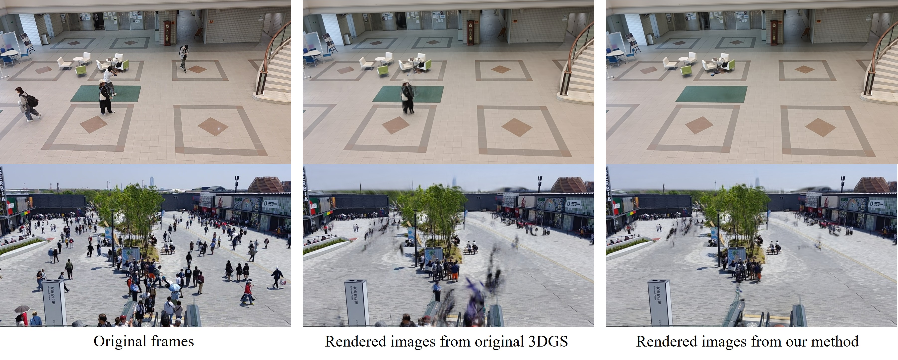
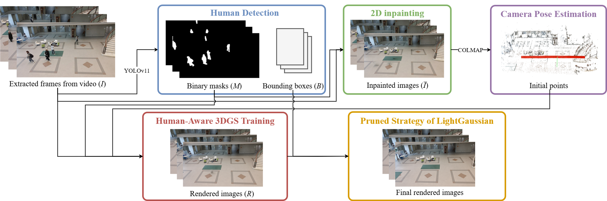

# Human-Aware Inpainting for 3D Gaussian Splatting in Dynamic Scenes

[ISMAR 2025 Poster Paper](https://norihi-k.com/paper/ismar25_liao.pdf) | [Demo Video](https://www.youtube.com/watch?v=Zr8YoUZKxJM)

### Abstract
Reconstructing 3D scenes from casual videos is essential for creating immersive AR/VR experiences. However, real-world captures in public spaces often include people, introducing artifacts and raising privacy concerns. We propose a human-aware 3D Gaussian Splatting (3DGS) pipeline that automatically removes transient human artifacts while maintaining scene fidelity. 

Our pipeline integrates human detection, 2D inpainting to cleanse human-related 3D initial points, masked 3DGS training, and targeted pruning to suppress residual errors. Experiments on real-world videos, including crowded environments, show that our method effectively reduces human artifacts while maintaining high-quality detail, enabling practical and immersive virtual scene generation.

## Result



## Pipeline Overview



## Equipment requirement
* Windows 11
* RTX4090
* Cuda 11.8
* Anaconda PowerShell

## Enviornment Installation

Follow below link to install environment for each step.
For more details, please check the [slide](https://drive.google.com/file/d/1gasSqpMVCJ1-1dx9ND8HrBzPrULGUvqB/view?usp=drive_link).

1. [FFmpeg](https://ffmpeg.org/download.html) → extracted frames
2. [YOLOv11](https://github.com/ultralytics/ultralytics) → human detection
3. [ZITS (CVPR2022)](https://github.com/DQiaole/ZITS_inpainting) → 2D inpainting
4. [COLMAP](https://github.com/colmap/colmap?tab=readme-ov-file)
5. [3DGS](https://github.com/graphdeco-inria/gaussian-splatting) → human-aware 3D reconstrction training 
6. [LightGaussian](https://github.com/VITA-Group/LightGaussian) → pruned unwanted splats in human region

## Step by step

For more details, please check the [slide](https://drive.google.com/file/d/1gasSqpMVCJ1-1dx9ND8HrBzPrULGUvqB/view?usp=drive_link).

1. Record a video and extract frames using ***FFMPEG***.
2. Detect humans on the extracted frames using ***YOLOv11***.
3. Inpaint the humans in the frames utilizing ***ZITS (CVPR2022)***.
4. Use the inpainted frames to estimate camera pose and get 3D initial points.
5. Detect humans **again** on the rectified images.
    * Resize the **original images** to match the rectified image generated by estimation.
    * Run YOLOv11 again on the resized images.
6. Train ***human-aware 3DGS***.
    * The codebase is based on [3DGS](https://github.com/graphdeco-inria/gaussian-splatting), modified part is shown as below:
        * Adding mask input (image)
        * Training loss excluded mask region
7. Remove unnecessary splats inside the **rectified bounding box** areas following the strategy of ***LightGaussian***.
    * The codebase is based on  [LightGaussian](https://github.com/VITA-Group/LightGaussian), modified part is shown as below:
        * Adding mask input (image & bounding box)
        * Training loss excluded mask region
        * Prune the unnecessary splats inside bounding box 

## Datasets and Results
[Datasets](https://drive.google.com/file/d/1tuY-CfSx67o43QUs5KAVixnwxKmvMUD-/view?usp=drive_link) | [Results](https://drive.google.com/file/d/1kmda5yVy8s81UoWLkpZy1voB1Oc1r6at/view?usp=drive_link)

All source videos were captured using a smartphone camera. 
* demo: A campus lobby with students walking by.
* Expo_escalator: A first-person perspective on an escalator at the Osaka Expo 2025, featuring surrounding crowds.
* Expo_pavilion: Visitors lining up in front of a pavilion at the Osaka Expo 2025.

## BibTeX
```
@inproceedings{Liao2025,
  title = {Human-Aware Inpainting for 3D Gaussian Splatting in Dynamic Scenes},
  url = {http://dx.doi.org/10.1109/ISMAR-Adjunct68609.2025.00197},
  DOI = {10.1109/ismar-adjunct68609.2025.00197},
  booktitle = {2025 IEEE International Symposium on Mixed and Augmented Reality Adjunct (ISMAR-Adjunct)},
  publisher = {IEEE},
  author = {Liao,  Pei-Ru and Kawai,  Norihiko},
  year = {2025},
  month = oct,
  pages = {801–802}
}
```
## Reference
```
[1] B. Kerbl, G. Kopanas, T. Leimk¨uhler, and G. Drettakis. 3d gaussian splatting for real-time radiance field rendering. ACM Transactions on Graphics, 42(4), July 2023.
[2] Z.Fan, K.Wang,K.Wen,Z.Zhu,D.Xu,andZ.Wang. Lightgaussian: Unbounded 3d gaussian compression with 15x reduction and 200+ fps, 2023.
[3] Q. Dong, C. Cao, and Y. Fu. Incremental transformer structure enhanced image inpainting with masking positional encoding. In CVPR, 2022.
[4] G. Jocher, J. Qiu, and A. Chaurasia. Ultralytics YOLO, Jan. 2023.
[5] J. L. Sch¨onberger and J.-M. Frahm. Structure-from-motion revisited. In CVPR, 2016.
```